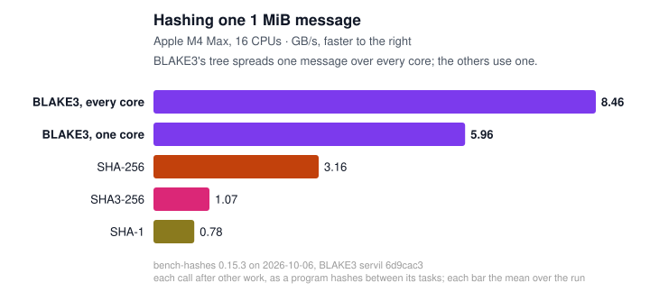

# bench-hashes

Written by GPT-5.6 Sol, Claude Fable 5, and Claude Opus 5.5 to my (Zooko's) specifications.

## Is BLAKE3 faster than SHA-256?

It depends on your computer, on how long your messages are, and on how
your program calls the hash. bench-hashes measures them on your
computer, from 64-byte messages to 128 MiB and in batches of small
messages, called now and then or nonstop, and draws the answer as an
interactive graph you open in a web browser. One message of 1 MiB on an
Apple M4 Max:



Every size, on each machine measured so far:

- [Apple M4 Max, macOS](https://johnservil.github.io/bench-hashes/benchmark-results/AppleM4Max.darwin25/bench-hashes.graph.svg)
- [A Linux VM on that Mac](https://johnservil.github.io/bench-hashes/benchmark-results/aarch64.linux618520virt/bench-hashes.graph.svg)

## Run it on your computer

You need [Rust](https://rustup.rs) and a C compiler: Xcode's command-line
tools on macOS (`xcode-select --install`), gcc or clang on Linux, or the
Visual Studio C++ build tools on Windows. Then:

```sh
git clone https://github.com/johnservil/bench-hashes
cd bench-hashes
cargo run --release
```

To measure a released version, so that others can compare their results
with yours, check out its tag first: `git checkout` followed by a tag
that [Releases](https://github.com/johnservil/bench-hashes/releases)
lists.

The first build takes a minute or two; the run then measures for about
a minute and needs about 1 GB of free memory. The numbers come out most
accurate when nothing else busy runs on the computer meanwhile.

## Read your results

The run writes these files to `benchmark-results/`, in a folder named after
your CPU and operating system:

- `bench-hashes.graph.svg`: the graph. Open it in a web browser.
- `bench-hashes.chart.svg`: one 1 MiB message as bars, a picture to share
  (a full run draws it; `bench-hashes chart` draws it again from a
  samples file).
- `bench-hashes.result.txt`: the same numbers as text tables.
- `bench-hashes.guide.html`: for programmers who want to call BLAKE3
  from their own code (see "Which function to use", below).
- `bench-hashes.samples.tsv`: every single measurement, for your own
  analysis.
- `bench-hashes.checks.txt`: consistency checks, for people who
  maintain the benchmark or a hash.

The graph has a plot for each way a program hashes. A message in one
buffer, and a batch of 64-byte messages (a Merkle tree's nodes), each
called now and then: *after other work*, as a program hashes between its
other tasks, and *after idling*, as a server waits for its next request.
Messages and batches hashed *nonstop*, one after another, and many
messages at once, each arriving in pieces, by one program and by two at
once. In every plot, higher
is faster. Hover over a dot, or tap it, to compare the hashes there; the
chips at the top right choose the plots, and "How to read this graph"
under the title explains the rest.

Under the title the graph also says when other programs were busy or the
computer ran on battery during the run. If it does, run again quieter
and plugged in: busy programs slow the results, and battery power changes
which cores run them.

The contenders:

- **BLAKE3 servil mt**: [a fork](https://github.com/johnservil/BLAKE3) of
  the official BLAKE3 Rust crate, faster on 64-bit Arm and above all on
  Apple M4-class chips (on other CPUs its kernels are the official
  crate's), with its own threads to spread large inputs over your CPU
  cores and a queue for inputs that come one after another.
- **BLAKE3 servil st**: the same on one thread.
- **SHA-256** (the `sha2` crate) and **SHA-256 ring** (the `ring`
  crate): SHA-256 with the CPU's SHA-256 instructions where it has them;
  two implementations, since each is fastest at some sizes on some
  computers.

## Which function to use

Programmers who want this speed in their own program open
`bench-hashes.guide.html`. It asks a few questions about how the program
receives its data (one thread or several; one message, pieces, or a
batch; whether the thread keeps up; whose buffer the data lands in) and
answers with one call from the servil crate, a complete Rust example, and
that call's measured speed on your computer beside SHA-256. Every
question has an "I'm not sure" answer that leads to a safe choice.

`cargo run --release -- --all` adds every other hash the benchmark knows
(the official BLAKE3 crate, SHA3-256, SHA-1DC, and on Apple
CommonCrypto's SHA-256) and takes longer; `--contenders` picks any set
by name, including the official crate on its thread pool
(`blake3-official-mt`), which runs only when named (`--list` shows the
names).

## How fast is b3sum?

`bench-hashes b3sum` times builds of `b3sum`, the BLAKE3 command-line
tool, as you run it: each run a new process, from its start to its exit,
on fixed files from 4 KiB to 1 GiB and on two directory trees, with the
files in the page cache (read moments before) and, on Linux and macOS,
evicted from it before each run (read from storage):

    sh tools/b3sum-contenders.sh /path/to/BLAKE3-fork /tmp/b3c
    cargo run --release -- b3sum --files ~/b3sum-files official=/tmp/b3c/b3sum-official-1.8.2 fork=/tmp/b3c/b3sum-abc1234

A contender is `NAME=COMMAND`, a `b3sum` and its flags (the files are
appended); `tools/b3sum-contenders.sh` builds official BLAKE3's `b3sum`
1.8.2 and the fork's at given commits. The first contender is the one
the others are compared with. `--files` chooses where the files live:
put them on the storage you care about (they are made once, 1.4 GiB, and
kept). `--quick` runs a smaller set in seconds. The report, samples, and
a chart go to `benchmark-results/`, as `b3sum.result.txt`,
`b3sum.samples.tsv`, and `b3sum.chart.svg`; `bench-hashes compare` reads
the samples as it reads the hashes'.

Results so far, warm and cold, official b3sum beside the fork's:

- [Apple M4 Max, macOS](https://johnservil.github.io/bench-hashes/benchmark-results/AppleM4Max.darwin25/b3sum.chart.svg)
- [A Linux VM on that Mac](https://johnservil.github.io/bench-hashes/benchmark-results/aarch64.linux618520virt/b3sum.chart.svg)

## Share your results

Your graph is one self-contained file. Post it and `bench-hashes.result.txt`
anywhere people can download them: an issue, a gist, a forum. Anyone who
opens the graph in a browser sees it just as you do.

Or publish them on the web from your own copy of this repository, as the
results above are:

1. On GitHub, fork `johnservil/bench-hashes`. If you cloned it before
   forking, point your clone at your fork:
   `git remote set-url origin https://github.com/YOU/bench-hashes`
2. Commit your results and push them:
   ```sh
   git add benchmark-results
   git commit -m "Results for my computer"
   git push
   ```
3. On GitHub, in your fork's Settings, under Pages, choose "Deploy from a
   branch", the branch `main`, and the folder `/ (root)`.

A minute later your graph is at
`https://YOU.github.io/bench-hashes/benchmark-results/FOLDER/bench-hashes.graph.svg`,
where FOLDER is the folder the run created.

We would be glad to add your results to ours: once they are pushed to
your fork, open a pull request to `johnservil/bench-hashes` on GitHub.
Say in it what computer you ran on. Results from a machine we already
have go beside ours rather than over them: rename your folder first,
for example
`git mv benchmark-results/AppleM4Max.darwin25 benchmark-results/AppleM4Max.darwin25.yourname`.

## More

`cargo run --release -- --help` lists the other options, such as more
BLAKE3 and SHA implementations. [METHODOLOGY.md](METHODOLOGY.md) explains
how bench-hashes measures, and what each contender runs. To race your own
hash against these, [CONTRIBUTING.md](CONTRIBUTING.md) says how to add
it.
